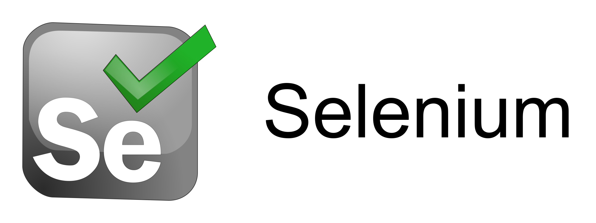

# Testing Integrations

These are demonstrations of industry recognized developer tools used to automate E2E browser testing. The E2E tests are all meant to be run against [**javaspringvulny**](https://github.com/kaakaww/javaspringvulny), an intentionally vulnerable web application, running on `https://localhost:9000`

All of these e2e testing commands should be run from this directory.

## Authentication

To perform E2E testing on an application, these testing tools require authentication into the application be scripted and executable. HawkScan provides [common patterns for Authentication](https://docs.stackhawk.com/hawkscan/authenticated-scanning/), and **javaspringvulny** demonstrates multiple forms of authentication.

#### form authentication
#### jwt token authentication
#### header token authentication
#### basic authentication
#### multi-form authentication

## [Cypress](https://www.cypress.io/)

Cypress is a frontend testing tool that automates the testing of web applications through a browser already installed on the host system. Cypress test specs are executed as asynchronous jquery commands, that control the selection and testing of elements on the page.

At StackHawk, _we like Cypress_, and encourage it's use for teams looking to establish E2E testing as a function of their engineering quality, or who are newer to frontend QA or integration testing.

Follow the [Cypress guide for getting started](https://docs.cypress.io/guides/getting-started/installing-cypress).

### Custom Authentication

Cypress allows for the creation of [custom commands](/cypress/support/commands.ts). When using Cypress with typescript, custom commands require [command signatures](/cypress/support/index.d.ts) to be updated.

### Testing

#### Headed Testing

`npx cypress open`

This opens the Cypress UI, where specific tests can be selected and run headed.

#### Headless Testing

`npx cypress run -s cypress/e2e/javaspringvulny/*`

This tells Cypress to run the specific test specs. By default tests will run headless.

### Scanning with HawkScan

See the docs for scanning [Cypress with Custom Scan Discovery](https://docs.stackhawk.com/hawkscan/scan-discovery/custom.html). You can use the sample [cypress-stackhawk.yml](./cypress/cypress-stackhawk.yml) file for an example of scanning a web application with it.

### Best Practices

* Cypress provides native support for typescript, which makes e2e testing and developing custom cypress commands much easier.
* Run your Cypress tests in the pipeline! Create a custom docker image with Cypress and HawkScan and everything your web application needs to run

## [Playwright](https://playwright.dev/)

Playwright is a frontend testing tool that automates the testing of web applications through the browser executables bundled with playwright. Playwright test specs will execute as javascript running in the web application, selecting and testing elements on the page.

At StackHawk, _we like Playwright_, and encourage it's use for teams with complex browser requirements, or with established CI/CD pipelines that support custom images, so they can take full advantage of Playwright.

Follow the [Playwright guide for getting started](https://playwright.dev/docs/intro)

### Custom Authentication

Cypress allows for the creation of [custom commands](/cypress/support/commands.ts). When using Cypress with typescript, custom commands require [command signatures](/cypress/support/index.d.ts) to be maintained.

### Headed Testing

`npx playwright test -c playwright/out --headed --config=playwright/playwright.config.ts`

### Headless Testing

`npx playwright test -c playwright/out --config=playwright/playwright.config.ts`

### Scanning with HawkScan

See the docs for scanning [with Custom Scan Discovery](https://docs.stackhawk.com/hawkscan/scan-discovery/custom.html#cypress). You can use the sample [cypress-stackhawk.yml](./cypress/cypress-stackhawk.yml) file for an example of scanning a web application with it.

### Best Practices

* Playwright encourages creating an extension of the Page class with [test-fixtures](https://playwright.dev/docs/test-fixtures), that will use the resources and details of the tested page to perform custom commands. This is demonstrated with the [PlayWrightPage](./playwright/playwrightPage.ts)

## [Selenium](https://www.selenium.dev/)

_Selenium Testing instructions coming soon._